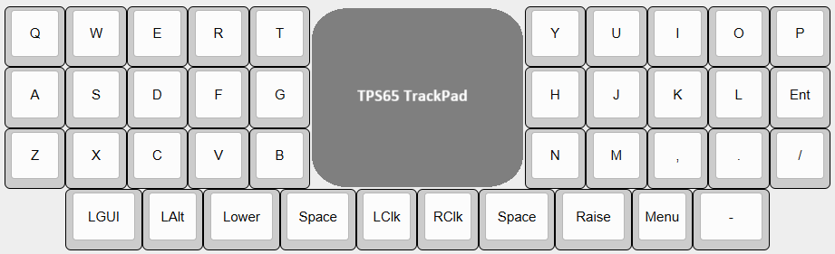

# Girasole (40)
(Designing Phase)
The Girasole (40) will be the self-maid keyboard which targets 30% ortholinear layout with a touchpad.

## Parts List
(In study)

### Parts need to be prepared/purchased
T.B.D

|Part|Quantity|Remarks|
|---|---|---|
|Wired controller board|1|T.B.D.(considering to use RP2040-Zero)|
|Conthrough|x||
|USB-C cable|1||
|Choc socket|40|e.g. Kailh PG1350 KeySwitches Contact (CPG135001S30)|
|Choc V2 switch|40||
|Diode|x||
|Keycap|40||
|Touchpad Module|1|Considering to use Azoteq TPS65|
|xxx|x|xxx|

### Parts need to be ordered/printed
T.B.D

|Part|Quantity|Remarks|
|---|---|---|
|PCB|1||
|Top case|1||
|Bottom case|1||

## Keyboard build instruction
T.B.D.